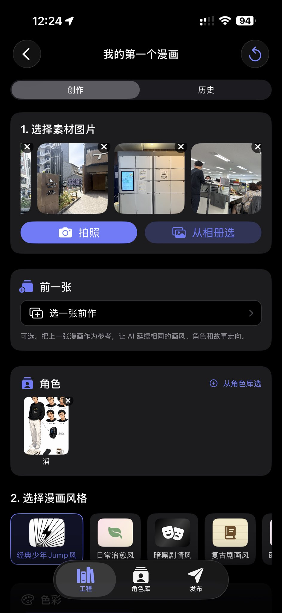
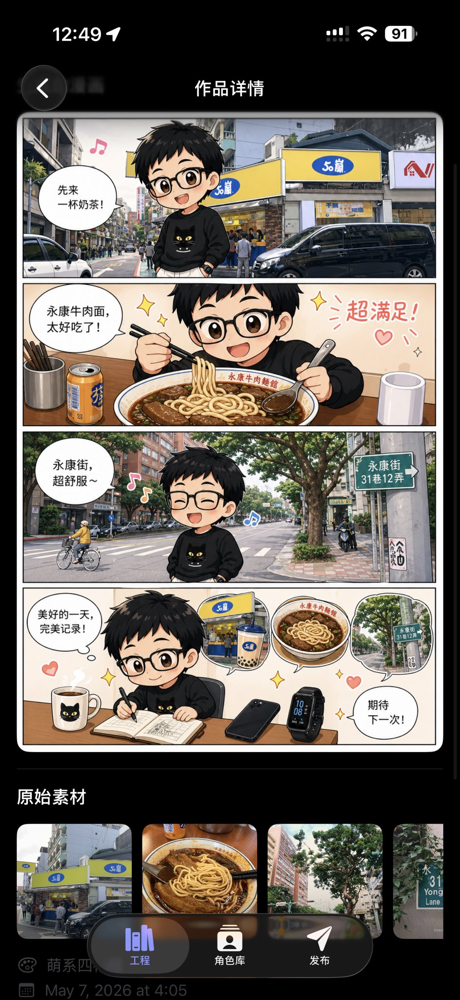
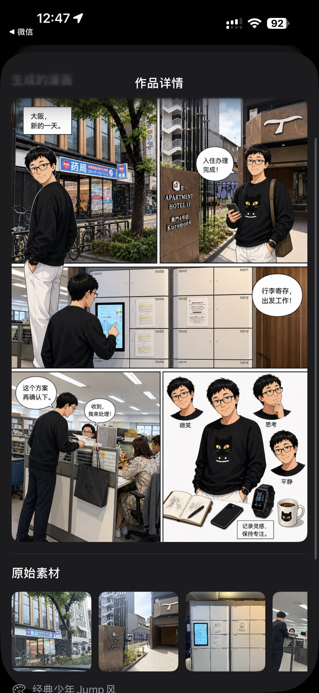
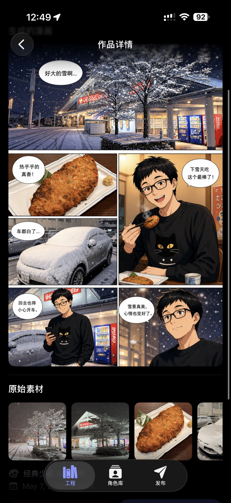

# 漫画人生 · LifeManga
> 这是在家里闲着没事，随手写的一个项目。本身不想靠这些闲暇时间搞出来的东西盈利，索性把源码公开出来，让大家都可以自由的去使用。
> 把生活中随手拍的照片，自动转化成日式漫画风格的 iOS App。
> 内置工程管理、角色库、故事模式、后台任务系统。

**技术栈**：SwiftUI · Swift 5 · iOS 17+ · OpenAI `gpt-image-2`（图像）+ GPT-5 系列（编剧）

---

## 功能

### 创作
- 多张参考图（拍照 / 多选相册）→ 一张 / 多张漫画图
- **8 种漫画风格** 一键切换：少年 Jump 风、日常治愈风、暗黑剧情风、复古剧画风、萌系四格、运动热血、科幻机甲、悬疑氛围
- **彩色 / 黑白** 任意切换
- **气泡文字** 5 种模式：中文 / 日文 / 英文 / 留空 / 不画气泡
- 自由补充 prompt（"主角戴墨镜""下雨场景"…）

### 工程化
- 「工程」概念隔离每部漫画。每个工程下有独立的「创作 / 历史」分区
- **「前一张」** 续接：从历史里挑一张作为风格参考，新一张能续接画风、人物造型、剧情

### 角色库
- 从真人照片生成多视图设定稿，支持 9 种艺术风格：日漫风 / 美漫风 / 韩漫风 / 萌系 / Q 版 / 3D 渲染 / 半写实 / 水彩 / 像素风
- 「动作姿势池」：5 大类共 30+ 个姿势，多选一次出图（合并成一张设定稿，省 token）
- 角色可被「载入」到任意创作页作为参考图

### 故事模式
- 第 1 步：GPT-5 看你的照片自动写多格剧本（标题 / 概要 / 每格台词与画面）
- 第 2 步：剧本可由你编辑后再画
- 自动控制 2~9 格分镜数

### 任务系统
- 全部图像生成走 `URLSessionConfiguration.background`，**锁屏 / 切 App 不会中断**，完成后系统通知
- 任务面板实时显示日志、首字节时刻、已运行时长、错误码
- 失败 / 超时未知任务可手动「重新生成」，输入图自动恢复
- **绝不自动重试** `gpt-image-2`：图像生成是长 GPU 任务，超时后无法判断 OpenAI 是否仍在跑，自动 retry 会重复扣费
- 同 hash 请求 60 秒内拦截，防误触

---

## 截图

### 创作页

<p align="center">
  
</p>

选素材图、续接前一张、载入角色、挑风格、补充 prompt——一个屏幕讲完。

### 几张实际生成出来的漫画

| 萌系四格 · 永康牛肉面 | 经典少年 Jump 风 · 大阪游记 | 经典少年 Jump 风 · 雪夜炸物 |
|:---:|:---:|:---:|
|  |  |  |

> 这几张都是 App 里直接拍照 / 选图 + 选角色 + 选风格生成的，没有任何后期。

---

## 跑起来的 7 步清单

> 全程大概 15 分钟，前提是已经有 Apple ID + OpenAI 账号。

### ① 装 Xcode 15+

App Store 装最新 Xcode（macOS 也得够新，Xcode 15 要 macOS 13.5 起步）。

### ② Clone 项目

```bash
git clone https://github.com/iam567/LifeManga.git
cd LifeManga/LifeManga
open LifeManga.xcodeproj
```

### ③ 改 Bundle ID + 选 Team

Xcode 顶部选中 `LifeManga` target → **Signing & Capabilities**：

- **Team**：从下拉选自己的 Apple ID（没有就点 "Add an Account..." 登录，**免费 Apple ID 也能签**）
- **Bundle Identifier**：改成 `com.<你的名字>.lifemanga` 这种唯一字符串。**这步必须改**——`com.iam567.lifemanga` 我已经占了，撞 ID 苹果不让签

### ④ 真机运行

- iPhone 用数据线连 Mac → 解锁 → 弹"信任这台电脑"点信任
- Xcode 顶部设备选择器选你的 iPhone
- ⌘R 编译并安装到手机

> 模拟器也能跑，但拍照功能没法用（模拟器没摄像头）。从相册选图、做漫画都正常。

### ⑤ iPhone 上信任开发者证书

第一次跑会弹"未受信任的企业级开发者"导致 App 闪退。去：

设置 → 通用 → VPN与设备管理 → 找到你的 Apple ID → 点信任 → 回到桌面再点 App 就能进了

### ⑥ App 内填 OpenAI API Key

进入 App 后顶部会有黄色提示 → 设置 Tab → 粘贴 `sk-...` Key → 保存。

> Key 只存在本机 iOS Keychain，源码不含任何 Key。
> [platform.openai.com/api-keys](https://platform.openai.com/api-keys) 申请。

### ⑦ 完成 OpenAI Organization 验证

`gpt-image-2` 不是开箱即用的——OpenAI 强制要求做 organization 验证，没验证调用直接报 403。

[platform.openai.com](https://platform.openai.com) → Settings → Organization → **Verify Organization**（一般要交身份证 / 护照照片，1~2 个工作日审核）。

完成后回 App 试着生成一张漫画，能出图就成功了。🎉

---

## 容易踩的坑

| 坑 | 现象 | 解决 |
|---|---|---|
| **免费 Apple ID 签的 App 7 天后过期** | 一周后打开 App 闪退 | 重新连 Mac ⌘R 一次重签；或者付 $99/年开发者账号 |
| **免费 Apple ID 设备装机限制** | 装到第 11 个 App 时报错 | 一个免费 ID 一年只能装 10 个不同 App，删几个旧的 |
| **iOS 版本太老** | Xcode 跑到设备上提示 "iOS 17.0 or later required" | iPhone 升级到 iOS 17+，或者把 `IPHONEOS_DEPLOYMENT_TARGET` 调低（部分 SwiftUI 17 API 会失效） |
| **OpenAI 余额 $0** | 任何调用都 401 / `insufficient_quota` | 去 platform.openai.com → Billing 充 $5 起步 |
| **没做 organization 验证** | 调 `gpt-image-2` 报 403 `must verify organization` | 见上面第 ⑦ 步 |
| **国内网络** | 请求超时 / 挂 90 秒报错 | OpenAI API 在国内直连不通，需自行解决网络环境 |
| **同一台 iPhone 有多人的 LifeManga** | 数据混在一起 | 现在每个 Bundle ID 的 App 是独立沙盒，只要 ③ 步换了 Bundle ID 就互不干扰 |

---

## 项目结构

```
LifeManga/                              # 仓库根
├── README.md
├── LICENSE
├── .gitignore
└── LifeManga/                          # Xcode 项目根
    ├── LifeManga.xcodeproj
    └── LifeManga/                      # 主 target 源码
        ├── LifeMangaApp.swift          # App 入口
        ├── Assets.xcassets             # AppIcon、AccentColor
        ├── Models/
        │   ├── MangaStyle.swift        # 8 种漫画风格 + prompt
        │   ├── MangaItem.swift         # 工程 / 作品 / 角色 / 剧本 / 日志
        │   └── AppSettings.swift       # 全局设置
        ├── Services/
        │   ├── KeychainService.swift   # API Key Keychain 存储
        │   ├── OpenAIService.swift     # /v1/images/edits 与 /v1/chat/completions 调用、后台 URLSession、错误归类
        │   └── MangaStorage.swift      # 工程 / 作品 / 角色 / 任务 / 日志 持久化
        ├── ViewModels/
        │   └── MangaGeneratorViewModel.swift
        └── Views/
            ├── ContentView.swift       # 三大 Tab + 任务面板 + 日志面板
            ├── HomeView.swift          # 创作主页
            ├── MangaDetailView.swift   # 作品详情
            ├── HistoryView.swift       # 历史 / 收藏
            ├── SettingsView.swift      # 设置
            └── ImagePickerView.swift   # 相机包装
```

---

## 关键技术点

| 关注点 | 实现 |
|---|---|
| 后台不中断 | `URLSessionConfiguration.background(withIdentifier:)` + delegate 累积 data |
| 多图上传 | `multipart/form-data`，`image[]` 字段，先写临时文件再 `uploadTask(fromFile:)` |
| 上传体积 | 强制 `UIGraphicsImageRendererFormat.scale = 1.0`，JPEG 0.85 起步迭代压到 ≤500KB |
| 超时策略 | URLSession `timeoutForRequest = 300s` / `timeoutForResource = 600s`，**没有自动 retry** |
| 防重复扣费 | 输入指纹 `OpenAIImageRequest.fingerprint`，60 秒内同 hash 拦截 |
| 编剧 LLM | `gpt-5-mini` / `gpt-5` 通过 `/v1/chat/completions` + `response_format=json_object` |
| 剧本结构 | `MangaStoryScript { title, summary, panels[].caption/dialog/visual }` |
| API Key 安全 | iOS Keychain，`kSecAttrAccessibleAfterFirstUnlock` |
| 任务状态机 | `running → done / failed / timeoutUnknown`，App 重启时残留 running 归入 timeoutUnknown 而非 failed |
| 任务日志 | 内存中按 jobId 累积 200 条，含 INFO / SUCCESS / WARNING / ERROR / DETAIL 五级 |
| 输入图快照 | 失败任务的输入图自动落盘到 `Documents/PendingJobInputs/<jobId>/`，供「重新生成」恢复 |

---

## 添加新的漫画风格

打开 `Models/MangaStyle.swift`：

1. enum 加一个 case，如 `case cyberpunk`
2. 在 `displayName` / `subtitle` / `prompt` 几个 switch 里补齐
3. UI 不用改，画廊和选择器自动出现

prompt 写法建议：英文为主，4–6 句具体描述线条、阴影、风格参考、情绪氛围。

---

## 常见问题

**生成报 `must verify organization` (403)?**
`gpt-image-2` 需要在 OpenAI 后台完成 organization 验证。

**任务卡在 OpenAI 90 秒就超时了？**
URLSession 已经放到 600s，wall-clock 也已删掉。如果你 fork 之后还是 90s，确认你跑的是最新代码（`OpenAIService.swift` 里 `timeoutIntervalForResource = 600`）。

**任务变成「结果未知」（橙色）？**
说明客户端没收到响应、但 OpenAI 端可能正在跑或已经成功——避免无脑重试导致重复扣费。点重新生成前会弹确认框。

**生成很慢？**
画质 `high` 显著变慢，建议 `medium`。一次 1 张 比 4 张 快很多。多张参考图（>3 张）也会拖慢 OpenAI 处理速度。

**模拟器里点拍照没反应？**
模拟器没摄像头，按钮会自动禁用。请用真机或从相册选。

---

## 贡献

欢迎提 Issue / PR。新功能建议先开 Issue 讨论一下，避免做完了方向不一致。

---

## License

[MIT](./LICENSE) — 随便用、随便改、随便商用，有良心的提一下我的X账号：@iam678 就可以。

OpenAI API 调用产生的费用由你的 OpenAI 帐号承担，本项目作者不负责任何账单。
